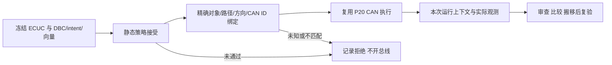

# P29 配置接受与同次 CAN 证据关联

项目 0.8 复用 P28 对象策略和 P20 CAN 向量内核。完整合成工程覆盖 Tx/Rx，第二工程仅有单 Tx。旧 0.1–0.7 项目保持兼容；0.6/0.7 不会因为本次升级而开总线。

```bash
python -m automotive_workbench.cli run-project examples/ecuc_runtime/integration.project.json --channel p29-demo --output output/p29-integration
python -m automotive_workbench.cli run-project examples/ecuc_runtime/transmitter.project.json --channel p29-demo --output output/p29-transmitter
python -m automotive_workbench.cli verify-ecuc-project output/p29-integration/bundle/project-report.json
python -m automotive_workbench.cli run-project-review output/p29-integration/bundle/project-report.json --output output/p29-review
```

打开 `bundle/index.html` 查看接受结果；原始观测在 `runtime/declared-runtime-report.json`，身份、运行条件与工具版本在 `runtime-link.json`，`ecuc-stage.json` 分别保留原静态/对象检查和 `runtime.*` 接受项。复验读取快照和观测，不重新开总线。



## 最小声明

0.8 保留基线/候选、policies、requirements，增加 `runtime.inputs` 三文件路径与 `runtime.bindings`。完整可运行样例位于 `examples/ecuc_runtime/`。一条关联必须明确以下内容：

| 字段 | 核对内容 |
|---|---|
| `policy_ids` | 已声明且强制接受的保护策略；至少一条保护 `object_id` |
| `object_id` | 唯一、精确的 ECUC 信号对象，当前支持通信路径成员 |
| `com_ipdu` / `route` / `canif_pdu` | 候选报告中的精确路径三元组，路径必须解析完整 |
| `vector_id` / `message` / `signal` | 已冻结向量、DBC 消息和信号，必须存在且精确相符 |
| `direction` / `frame_id` | 向量、路径方向与显式 CAN ID 相符；候选 CanIf 也必须提供唯一非条件化 CanIfTxPduCanId/CanIfRxPduCanId |

每条关联对应强制接受项 `/checks/runtime.<id>/status`，期望固定为 `passed`。每个声明向量都必须被绑定；不能通过额外未绑定向量间接执行。任一静态接受项或映射未通过，本次整份运行计划不开总线，不执行其他“碰巧通过”的向量。

同次绑定保留随机运行标识、候选快照 SHA-256、策略及运行声明 SHA-256、三个运行输入的哈希、请求与实际 backend 条件，以及 Workbench/Python/python-can/cantools 版本。virtual 通道附加本次随机标识；SocketCAN 使用显式通道。执行器自己的实际计划与预检计划不一致时拒绝，不覆盖执行器读到的计划。

重放核对运行上下文、输入和计划、方向、原始帧身份/长度/数据、按冻结 DBC 重新解码的值、端点清理与汇总。历史运行不能仅替换进本次报告后重算哈希便获得接受。该机制是内部一致性和来源绑定，不是签名、独立来源认证或防止重新伪造整套观测的可信硬件证明。

## 失败与未知

- 保护策略拒绝：原静态失败/未知保留；运行项记录 `static_acceptance_rejected`，没有运行文件。
- 精确路径、成员、方向或 CAN ID 不匹配/缺失：unassessed；重复身份为 blocked。
- 后端不可用：blocked，保留实际 probe 原因。
- 执行超时、错误帧身份等：failed，保留原始向量结果。
- 缺运行文件、输入漂移、上下文替换、改写观测并重算哈希：复验拒绝，不能生成新的 passed 结论。

比较两个结果时应使用相同声明、相同基线及显式相同 `--channel`；策略、向量输入、映射或请求执行条件改变时 not-comparable。本次随机运行标识不会让同一声明的重复执行不可比较。`run-project` 默认生成随机请求通道，正式回归比较应像上方示例指定固定请求通道。

## 自动与现场验收

```bash
python scripts/run_ecuc_runtime_scenarios.py --output output/p29-scenarios
python scripts/check_installed_ecuc.py --linked-runtime --output output/p29-installed
# 已有匹配当前 Python/平台的 wheelhouse 时可追加 --wheelhouse <目录>，全程离线安装。

bash scripts/linux/setup_vcan.sh --apply
bash scripts/linux/run_socketcan_projects.sh vcan0 output/p29-socketcan .venv/bin/python ecuc-runtime
```

安装检查构建本仓 wheel，准备 CAN 依赖后在仓库外新 venv 使用 `--no-index` 安装；移除 checkout import 来源再运行完整流程。没有本地 wheelhouse 时，准备步骤需要下载依赖；这与随后离线安装分开记录。

场景覆盖双工程、静态拒绝、错误映射/地址、超时、错误帧 ID、后端 blocked，以及同配置第二次执行；删除原输入后 9 份报告迁移复验和审查，验证运行回归及策略不可比较，五种篡改拒绝，再搬移整树。超时和错误 ID 是显式测试 harness 在真实 virtual 端点中注入的故障，不能称为目标 ECU 故障证据。

当前只建立公开合成 ECUC 与 DBC 的显式关联；没有厂商生成产物证明二者对应实际 BSW 代码。CAN 两端仍是本地进程中的端点；本机 vcan0 收发不等于独立 OpenBSW，更不等于物理 ECU。P29 独立 ECU 诊断证据关联尚待后续门，P23 历史结果不能自动替代。
